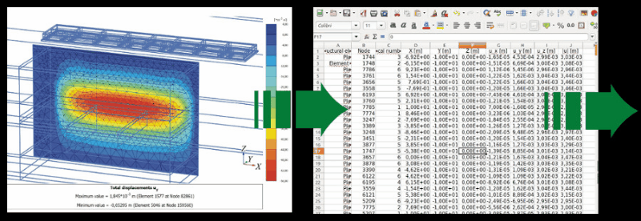
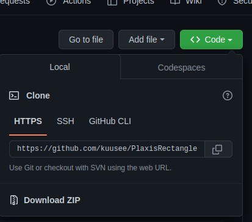
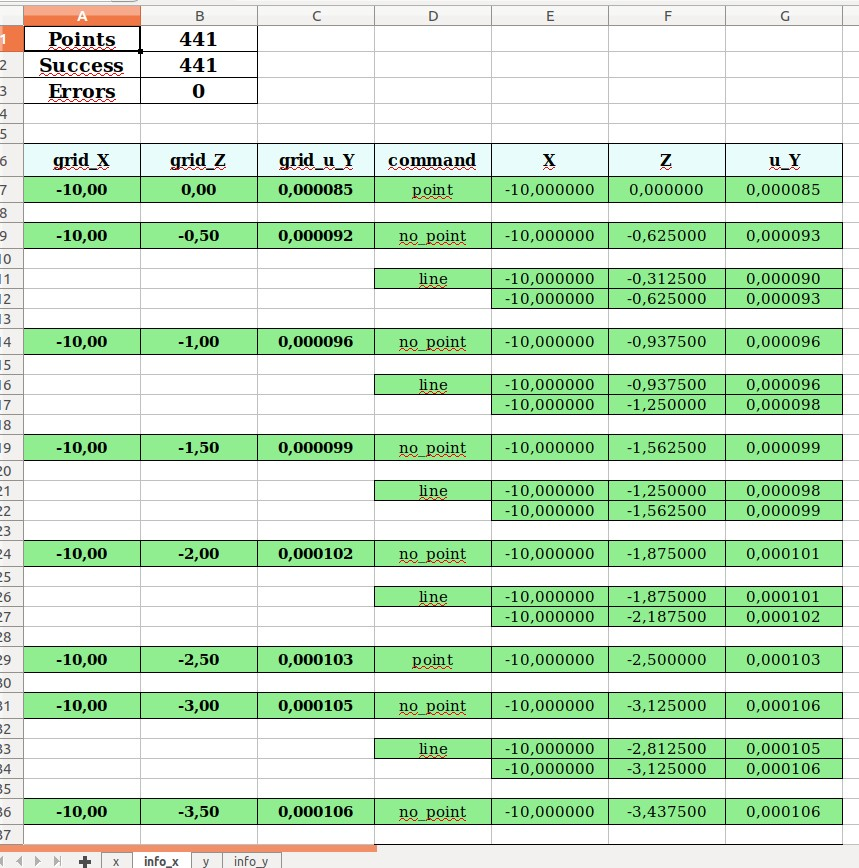
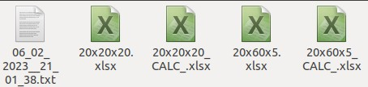
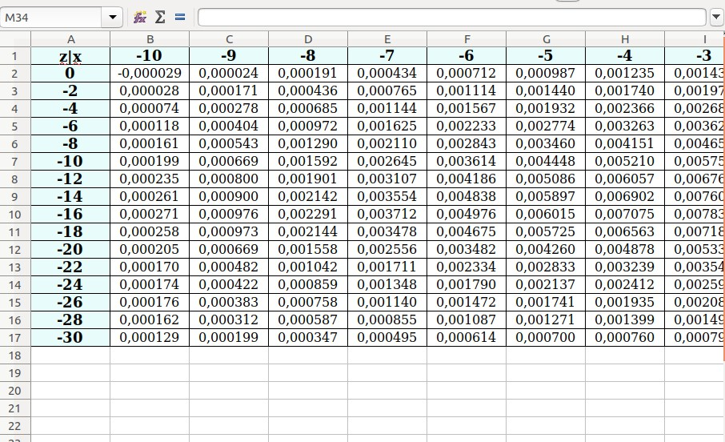

<h1 align="center">PlaxisRectangleGrid</h1>
</p>


<p align=center>
    <a target="_blank" href="#" title="top language">
        
    </a>
    <a target="_blank" href="https://www.python.org/downloads/release/python-373/" title="top language version">
        
    </a>
    <a target="_blank" href="https://opensource.org/licenses/MIT" title="License: MIT">
        
    </a>
    <a target="_blank" href="#" title="repo size">
        
    </a>
</p>

<p align="center">
    <a target="_blank" href="https://t.me/Imbestmanofplanet" title="Telegram">
        
    </a> 
</p>

<p align="justify"> Программа для преобразования перемещений из треугольной сетки Plaxis3D, в прямоугольную. Разработана для НИОКРа: <a target="_blank" href="https://www.elibrary.ru/item.asp?id=42396478">"РАЗРАБОТКА РЕКОМЕНДАЦИЙ ПО УЧЕТУ УГЛОВОГО ЭФФЕКТА..."</a>.
</p>
<p align="justify">Принимает на вход файлы данных в формате .xls и выводит файлы формата .xls с координатами узлов прямоугольной сетки и вычисленным перемещением.
</p>
<p align=center>Является переработанной версией алгоритма
    <a target="_blank" href="https://github.com/kuusee/CNMesh">CNMesh</a>.
</p>

<p align=center>
    
</p>


<h2 align="center">Как работает?</h2>
<p align="justify">Разбиваем плоскость XoZ на 4 четверти по узлу(центр этого разбиения) созданной прямоугольной сетки. Ищем в каждой четверти по 1 одной ближайщей точки из входных данных. Далее в зависимости от кол-ва найденных точек и их расположения относительно узла применяем методы интерполяции // пересечения прямой и плоскости // совпадения точек для определения перемещения в данном узле. Повторяем для всех узлов.</a>.

<h2 align="center">Структура проекта</h2>

```
PlaxisRectangleGrid/
    ├── PlaxisRectangleGrid/
    │   ├── classes.py
    │   ├── calc_func.py
    │   └── utils.py
    ├── data/
    ├── app.py
```


**PlaxisRectangleGrid**:

- `classes.py` файл классов программы.


- `calc_func.py` файл с вычислительными функциями.


- `utils.py` файл второстепенных функций.


**data**:

- Примеры входных и выходных файлов, пример файла лога.

**`app.py`** Основной файл программы.

<h2 align="center">Установка</h2>

Требуется **Python 3.7.3+**

Загружаем из терминала Linux с github:

`git clone https://github.com/kuusee/PlaxisRectangleGrid.git`

или скачиваем и распаковываем:

<p align=center>
    
</p>


Из папки проекта устанавливаем зависимости:

`pip install -r requirements.txt`


<h2 align="center">Как использовать?</h2>

**Настраиваем:**

1) Путь до папки с входными и выходными файлами: 
    
    `PATH_INPUT = 'путь до файлов/'`


2) Постфикс для файла вывода(необязательно):

    `OUTPUT_FILENAME_POSTFIX = '_CALC_'` 


3) Названия листов и номера колонок с данными (X, Z, u_Y) во входном файле:

    ```
    COLUMNS_COORD = {
        'x': (3, 5, 7),
        'y': (4, 5, 6),
        'default': (3, 5, 7)
    }
    ```

4) Шаг сетки в зависимости от глубины Z:
    
    ```
    STEP_Z = {
        -10: -0.5,
        -15: -1.,
        -22: -1.5,
        -30: -2,
    }
    ```

5) Шаг сетки в зависимости от длины 2 * X установлен как 1. если < 60 и 5. если > 60. Изменить можно в файле `PlaxisRectangleGrid/classes.py`:

    ```
    class RectangleGrid(object):
    ...
    ...
    ...
        def set_step_x(self) -> float:
            """
            Устанавливает шаг сетки по X.
            """
            return 1. if self.length < 60 else 5.

    ```

6) Размер окрестности поиска ближайших точек по осям:

    ```
    EPS_X = 1  # размер окрестности поиска по X
    EPS_Z = 1  # размер окрестности поиска по Z
    ```

7) Листы в excel для записи операций(в случае False, существенное ускорение работы):

    `INFO_SHEETS = False`

<p align=center>
    
</p>


Запускаем файл **`app.py`**.

Выбираем файлы для расчета.


По окончанию расчета в папке PATH_INPUT будут готовые файлы и файл лог.
<p align=center>
    
</p>


Выходной файл имеет вид:
<p align=center>
    
</p>
